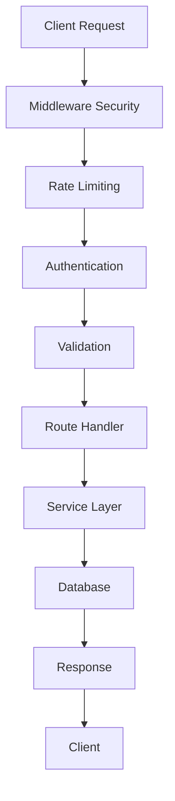

# 🏗️ Architecture Backend E-commerce

## 📊 Vue d'ensemble de l'Architecture

```
Backend_Ecommerce/
├── 📁 config/           # Configuration base de données
├── 📁 controllers/      # Contrôleurs (vide - logique dans routes)
├── 📁 database/         # Scripts et indexes SQL
├── 📁 docs/            # Documentation complète
├── 📁 middleware/       # Middlewares de sécurité et validation
├── 📁 migrations/       # Scripts de migration DB
├── 📁 models/          # Modèles de données (vide - SQL direct)
├── 📁 routes/          # Routes et logique métier
├── 📁 services/        # Services métier
├── 📁 socket/          # Gestion WebSocket/Socket.IO
├── 📁 uploads/         # Fichiers uploadés
├── 📁 utils/           # Utilitaires
└── 📄 server.js        # Point d'entrée principal
```

## 🔧 Stack Technique

### Core Technologies
- **Node.js** - Runtime JavaScript
- **Express.js 4.18.2** - Framework web
- **MySQL2 3.6.0** - Base de données
- **Socket.IO 4.8.1** - Communication temps réel

### Sécurité
- **JWT (jsonwebtoken 9.0.2)** - Authentification
- **bcryptjs 2.4.3** - Hachage des mots de passe
- **Helmet 7.2.0** - Sécurité HTTP
- **CORS 2.8.5** - Cross-Origin Resource Sharing
- **express-rate-limit 6.11.2** - Limitation de taux

### Validation & Sanitization
- **Joi 17.9.2** - Validation des schémas
- **express-validator 7.0.1** - Validation des requêtes
- **isomorphic-dompurify 2.26.0** - Sanitization XSS

### Utilitaires
- **Multer 1.4.5** - Upload de fichiers
- **Axios 1.11.0** - Client HTTP
- **dotenv 16.3.1** - Variables d'environnement

## 🏛️ Architecture en Couches

### 1. Couche de Présentation (Routes)
```javascript
// Exemple de structure de route
app.use('/api/auth', authRateLimit, securityLogger('auth'), require('./routes/auth'));
app.use('/api/products', require('./routes/products'));
app.use('/api/orders', require('./routes/orders'));
```

### 2. Couche Middleware
- **Sécurité** : Helmet, CORS, Rate Limiting
- **Authentification** : JWT Verification
- **Validation** : Joi, Express Validator
- **Logging** : Security Logger

### 3. Couche Métier (Services)
- **notificationService.js** - Gestion des notifications
- **socketManager.js** - Gestion des connexions Socket.IO

### 4. Couche de Données
- **MySQL** - Base de données relationnelle
- **Connection Pool** - Gestion optimisée des connexions

## 🔄 Flux de Données



## 🛡️ Sécurité Multi-Couches

### 1. Niveau Réseau
- **CORS** configuré pour domaines autorisés
- **Helmet** pour headers de sécurité
- **Rate Limiting** global et par endpoint

### 2. Niveau Application
- **JWT** pour l'authentification
- **Bcrypt** pour les mots de passe
- **Validation** stricte des entrées

### 3. Niveau Base de Données
- **Prepared Statements** (protection SQL injection)
- **Connection Pool** sécurisé
- **Indexes** optimisés

## 📡 Communication Temps Réel

### Socket.IO Architecture
```javascript
// Structure Socket.IO
const SimpleSocketServer = require('./socket/simpleSocketServer');
const socketServer = new SimpleSocketServer(server);
const io = socketServer.getIO();

// Middleware Socket.IO dans Express
app.use((req, res, next) => {
    req.io = io;
    req.socketServer = socketServer;
    next();
});
```

### Événements Socket.IO
- **Connexion/Déconnexion** utilisateurs
- **Messages** temps réel
- **Notifications** push
- **Statuts** de commandes

## 🗄️ Gestion des Données

### Configuration Base de Données
```javascript
// config/database.js
const mysql = require('mysql2/promise');

const pool = mysql.createPool({
    host: process.env.DB_HOST,
    user: process.env.DB_USER,
    password: process.env.DB_PASSWORD,
    database: process.env.DB_NAME,
    waitForConnections: true,
    connectionLimit: 10,
    queueLimit: 0
});
```

### Modèle de Données
- **50+ Tables** relationnelles
- **Relations** complexes avec clés étrangères
- **Indexes** optimisés pour les performances
- **Contraintes** d'intégrité

## 🔌 API Design

### RESTful Principles
- **GET** - Récupération de données
- **POST** - Création de ressources
- **PUT/PATCH** - Modification de ressources
- **DELETE** - Suppression de ressources

### Response Format
```javascript
// Succès
{
  "message": "Opération réussie",
  "data": {...}
}

// Erreur
{
  "error": "Message d'erreur",
  "details": [...]
}

// Pagination
{
  "products": [...],
  "pagination": {
    "page": 1,
    "limit": 20,
    "total": 150,
    "pages": 8
  }
}
```

## 🚀 Performance & Scalabilité

### Optimisations
- **Connection Pooling** MySQL
- **Middleware** optimisé
- **Caching** (à implémenter)
- **Compression** des réponses

### Monitoring
- **Health Check** endpoint
- **Error Logging** détaillé
- **Performance Metrics** (à implémenter)

## 🔧 Configuration Environnement

### Variables Essentielles
```env
# Base de données
DB_HOST=localhost
DB_USER=root
DB_PASSWORD=password
DB_NAME=ecommerce_alibaba

# JWT
JWT_SECRET=your_super_secure_jwt_secret
JWT_EXPIRES_IN=24h

# Serveur
PORT=3000
NODE_ENV=production
```

## 📦 Modules Principaux

### Routes (22 fichiers)
- **auth.js** - Authentification
- **products.js** - Gestion produits
- **orders.js** - Gestion commandes
- **messages_extended.js** - Messagerie avancée
- **simple-conversations.js** - Conversations simplifiées

### Middleware (6 fichiers)
- **security.js** - Sécurité globale
- **auth.js** - Authentification JWT
- **validation.js** - Validation des données

### Services (2 fichiers)
- **notificationService.js** - Notifications
- **socketManager.js** - Socket.IO

### Socket (2 fichiers)
- **simpleSocketServer.js** - Serveur Socket.IO simple
- **secureSocketServer.js** - Serveur Socket.IO sécurisé

## 🎯 Points Forts de l'Architecture

### ✅ Avantages
- **Modulaire** - Séparation claire des responsabilités
- **Sécurisé** - Multiple couches de sécurité
- **Scalable** - Architecture prête pour la montée en charge
- **Maintenable** - Code organisé et documenté

### 🔄 Améliorations Possibles
- **Caching** Redis pour les performances
- **Microservices** pour la scalabilité
- **GraphQL** pour l'optimisation des requêtes
- **Tests** unitaires et d'intégration

---

*Architecture conçue pour la robustesse, la sécurité et la performance*