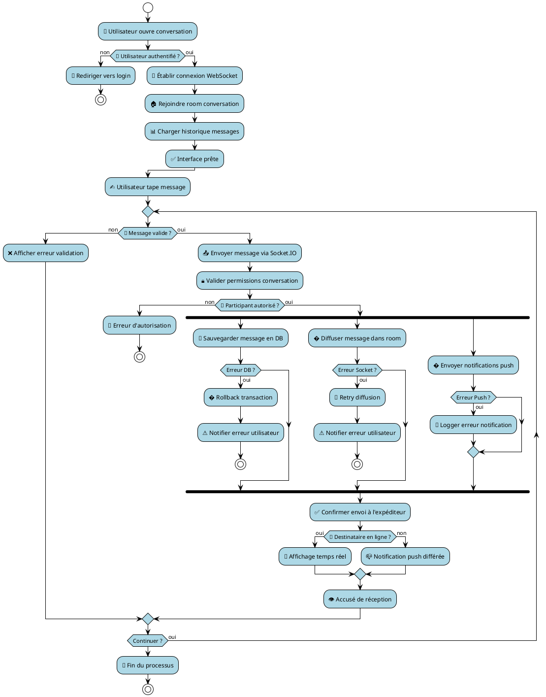
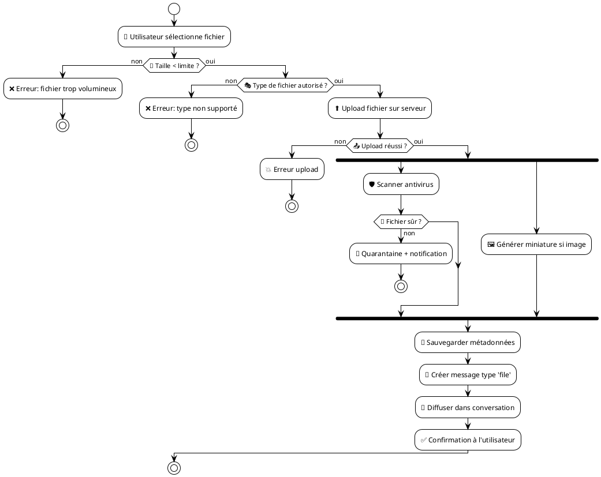
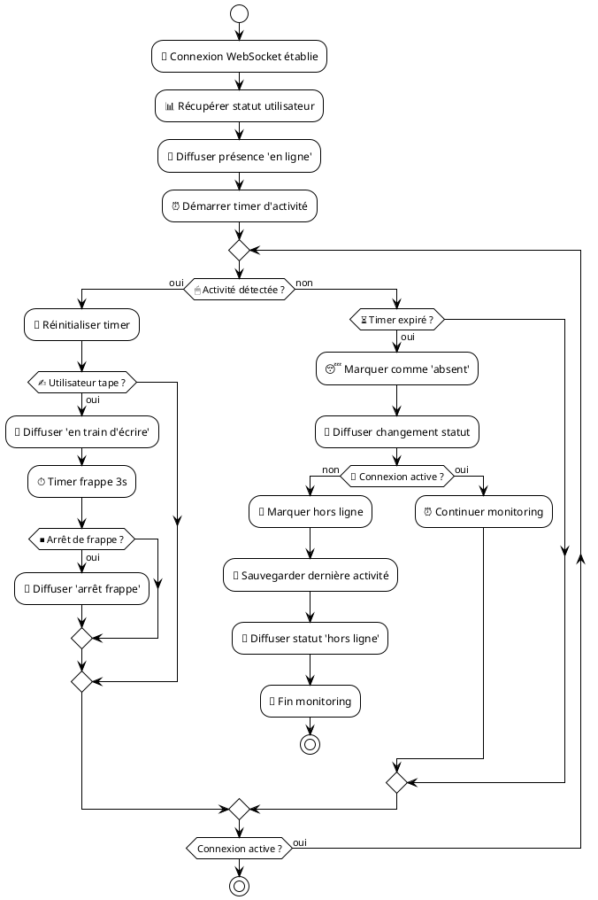
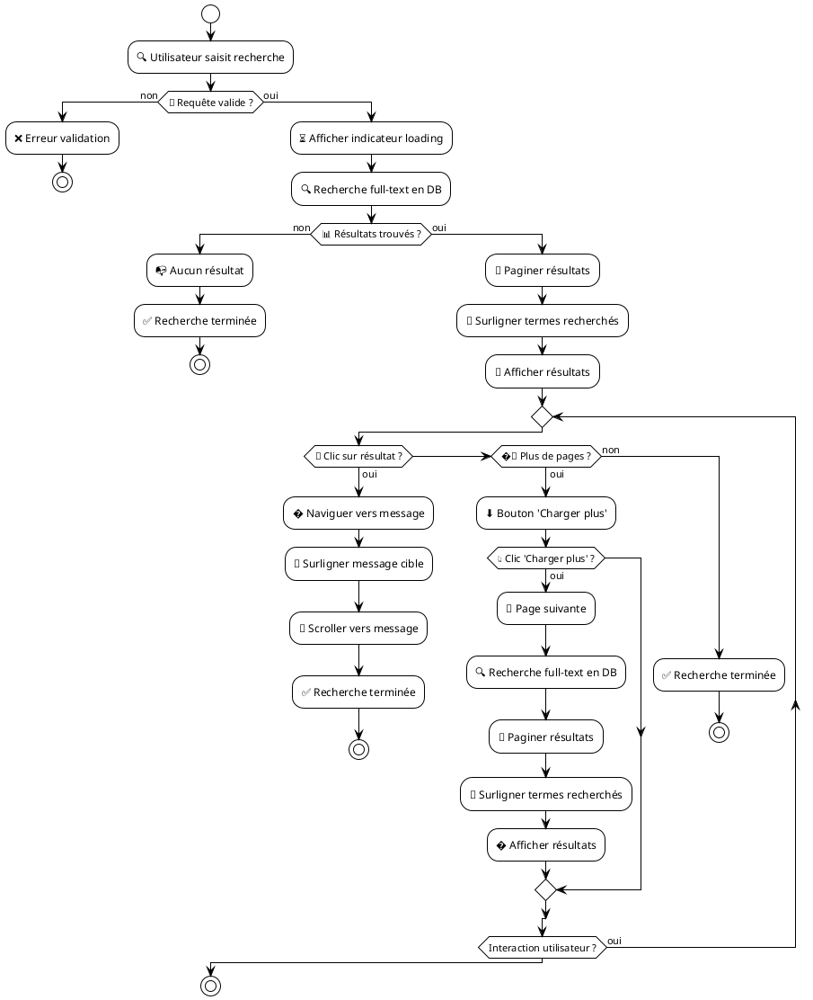
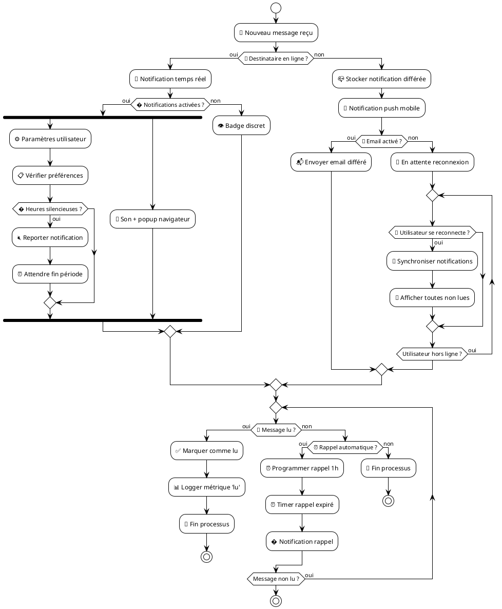

# 🔄 Diagramme d'Activité UML - Système de Messagerie
## GabMarketHub - Flux d'Activités Temps Réel

## 📱 **Flux Principal : Envoi de Message**



## 📎 **Flux Secondaire : Envoi de Fichier**



## 👁️ **Flux : Gestion de Présence**



## 🔍 **Flux : Recherche dans l'Historique**



## 🔔 **Flux : Système de Notifications**



## 📊 **Métriques et Analytics**

```plantuml
@startuml Metriques_Analytics
!theme plain
skinparam backgroundColor white

start
:📱 Événement messagerie;
:📊 Capturer métrique;

switch (📈 Type d'événement ?)
case (Message envoyé)
    :📤 Incrémenter compteur messages;
case (Utilisateur connecté)
    :👥 Mettre à jour utilisateurs actifs;
case (Fichier uploadé)
    :📎 Tracker taille/type fichier;
case (Temps de réponse)
    :⏱️ Enregistrer latence;
endswitch

:💾 Stocker en temps réel;

if (🎯 Seuil alerte atteint ?) then (oui)
    :🚨 Déclencher alerte;
    : Notifier administrateurs;
endif

:📊 Agrégation données;
:📈 Mettre à jour dashboard;

if (📅 Rapport quotidien ?) then (oui)
    :📄 Générer rapport;
    :📬 Envoyer rapport;
endif

:🔄 Continuer monitoring;

repeat while (Système actif ?) is (oui)

stop
@enduml
```

---

Ces diagrammes d'activité UML montrent les différents flux du système de messagerie temps réel, couvrant tous les aspects depuis l'envoi de messages jusqu'à la gestion des notifications et des métriques, en passant par la présence utilisateur et la recherche dans l'historique.