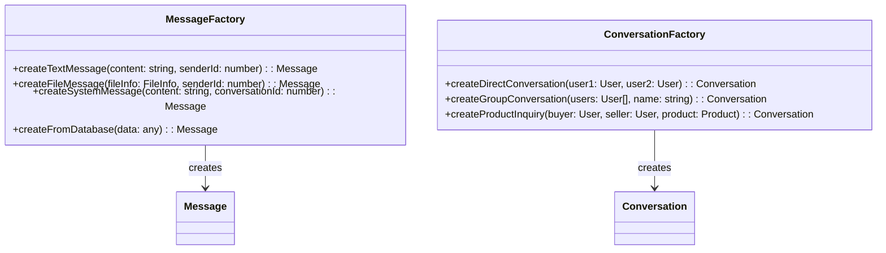
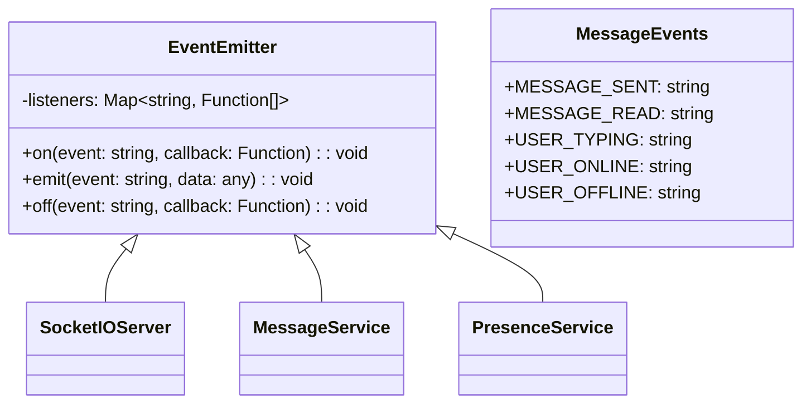
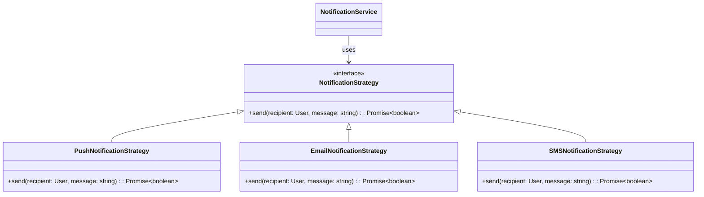
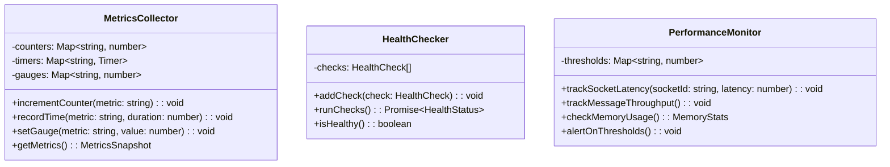

# 🏗️ Diagramme de Classes UML - Système de Messagerie
## GabMarketHub - Architecture Orientée Objet

```mermaid
classDiagram
    class SocketIOServer {
        -io: Server
        -authenticatedUsers: Map~string, User~
        -activeRooms: Map~string, Room~
        -messageQueue: Queue
        +initialize(): void
        +authenticate(socket: Socket, token: string): Promise~User~
        +handleConnection(socket: Socket): void
        +handleDisconnection(socket: Socket): void
        +broadcastToRoom(roomId: string, event: string, data: any): void
        +handleError(socket: Socket, error: Error): void
    }

    class Socket {
        -id: string
        -userId: string
        -rooms: Set~string~
        -isAuthenticated: boolean
        -lastActivity: Date
        +join(roomId: string): void
        +leave(roomId: string): void
        +emit(event: string, data: any): void
        +on(event: string, callback: Function): void
        +disconnect(): void
        +updateActivity(): void
    }

    class User {
        -id: number
        -nom: string
        -prenom: string
        -email: string
        -role_id: number
        -statut: string
        -isOnline: boolean
        -lastSeen: Date
        -socketId: string
        +getFullName(): string
        +isActive(): boolean
        +getPresenceStatus(): string
        +updateLastSeen(): void
        +setOnlineStatus(status: boolean): void
    }

    class Conversation {
        -id: number
        -participants: User[]
        -product_id: number
        -created_at: Date
        -updated_at: Date
        -last_message_id: number
        -unread_count: Map~number, number~
        +addParticipant(user: User): void
        +removeParticipant(user: User): void
        +isParticipant(userId: number): boolean
        +getRoomId(): string
        +getUnreadCount(userId: number): number
        +updateLastMessage(message: Message): void
        +markAsRead(userId: number): void
    }

    class Message {
        -id: number
        -conversation_id: number
        -sender_id: number
        -content: string
        -type: MessageType
        -created_at: Date
        -read_at: Date
        -file_url: string
        -metadata: JSON
        +isRead(): boolean
        +getFormattedContent(): string
        +getFileInfo(): FileInfo
        +markAsRead(): void
        +getAge(): number
        +serialize(): object
    }

    class MessageType {
        <<enumeration>>
        TEXT
        IMAGE
        FILE
        AUDIO
        LOCATION
        SYSTEM
    }

    class Room {
        -id: string
        -conversation_id: number
        -participants: Set~string~
        -typingUsers: Set~string~
        -created_at: Date
        +addUser(socketId: string): void
        +removeUser(socketId: string): void
        +broadcastMessage(message: Message, excludeSocketId?: string): void
        +setUserTyping(socketId: string): void
        +setUserStoppedTyping(socketId: string): void
        +getActiveUsers(): string[]
        +isEmpty(): boolean
    }

    class MessageService {
        -db: Database
        -socketServer: SocketIOServer
        -fileUploadService: FileUploadService
        +sendMessage(senderId: number, conversationId: number, content: string, type: MessageType): Promise~Message~
        +getConversationHistory(conversationId: number, page: number, limit: number): Promise~Message[]~
        +searchMessages(conversationId: number, query: string): Promise~Message[]~
        +markMessageAsRead(messageId: number, userId: number): Promise~void~
        +uploadFile(file: File, conversationId: number): Promise~string~
        +deleteMessage(messageId: number, userId: number): Promise~boolean~
    }

    class ConversationService {
        -db: Database
        -socketServer: SocketIOServer
        +createConversation(participants: User[], productId?: number): Promise~Conversation~
        +getConversation(conversationId: number): Promise~Conversation~
        +getUserConversations(userId: number): Promise~Conversation[]~
        +joinConversation(userId: number, conversationId: number): Promise~boolean~
        +leaveConversation(userId: number, conversationId: number): Promise~boolean~
        +getUnreadConversations(userId: number): Promise~Conversation[]~
        +archiveConversation(conversationId: number, userId: number): Promise~boolean~
    }

    class PresenceService {
        -redis: RedisClient
        -socketServer: SocketIOServer
        -userPresence: Map~number, PresenceInfo~
        +setUserOnline(userId: number, socketId: string): Promise~void~
        +setUserOffline(userId: number): Promise~void~
        +getUserPresence(userId: number): Promise~PresenceInfo~
        +getOnlineUsers(): Promise~User[]~
        +broadcastPresenceUpdate(userId: number, status: string): void
        +cleanupOfflineUsers(): Promise~void~
    }

    class PresenceInfo {
        -userId: number
        -isOnline: boolean
        -lastSeen: Date
        -socketId: string
        -status: PresenceStatus
        +isRecent(): boolean
        +getDisplayStatus(): string
        +updateActivity(): void
    }

    class PresenceStatus {
        <<enumeration>>
        ONLINE
        AWAY
        BUSY
        OFFLINE
        TYPING
    }

    class NotificationService {
        -pushService: PushNotificationService
        -emailService: EmailService
        -db: Database
        +sendMessageNotification(message: Message, recipients: User[]): Promise~void~
        +sendTypingNotification(conversationId: number, userId: number): void
        +sendPresenceNotification(userId: number, status: PresenceStatus): void
        +scheduleOfflineNotification(message: Message, recipient: User): Promise~void~
        +sendBulkNotifications(notifications: Notification[]): Promise~void~
    }

    class FileUploadService {
        -storage: StorageProvider
        -allowedTypes: string[]
        -maxFileSize: number
        +uploadFile(file: File, conversationId: number, userId: number): Promise~FileInfo~
        +validateFile(file: File): boolean
        +generateThumbnail(file: File): Promise~string~
        +deleteFile(fileUrl: string): Promise~boolean~
        +getFileMetadata(fileUrl: string): Promise~FileInfo~
    }

    class FileInfo {
        -originalName: string
        -fileName: string
        -url: string
        -size: number
        -mimeType: string
        -thumbnailUrl: string
        +isImage(): boolean
        +isVideo(): boolean
        +getHumanReadableSize(): string
        +getThumbnail(): string
    }

    class MessageValidator {
        -maxLength: number
        -forbiddenWords: string[]
        -urlPattern: RegExp
        +validateContent(content: string): ValidationResult
        +sanitizeContent(content: string): string
        +checkSpam(message: Message, userId: number): boolean
        +validateFileUpload(file: File): ValidationResult
    }

    class ValidationResult {
        -isValid: boolean
        -errors: string[]
        -warnings: string[]
        +hasErrors(): boolean
        +hasWarnings(): boolean
        +getErrorMessage(): string
    }

    class RateLimiter {
        -limits: Map~number, RateLimit~
        -redis: RedisClient
        +checkLimit(userId: number, action: string): Promise~boolean~
        +incrementCounter(userId: number, action: string): Promise~void~
        +resetLimit(userId: number, action: string): Promise~void~
        +getRemainingLimit(userId: number, action: string): Promise~number~
    }

    class RateLimit {
        -maxRequests: number
        -windowMs: number
        -currentCount: number
        -resetTime: Date
        +isExceeded(): boolean
        +getRemainingRequests(): number
        +getResetTime(): Date
    }

    class MessageQueue {
        -redis: RedisClient
        -workers: Worker[]
        +addMessage(message: QueuedMessage): Promise~void~
        +processMessages(): Promise~void~
        +retryFailedMessages(): Promise~void~
        +getQueueStats(): QueueStats
    }

    class QueuedMessage {
        -id: string
        -type: string
        -payload: any
        -priority: number
        -attempts: number
        -created_at: Date
        -process_after: Date
        +canProcess(): boolean
        +incrementAttempts(): void
        +shouldRetry(): boolean
    }

    class Analytics {
        -db: Database
        -metricsCollector: MetricsCollector
        +trackMessage(message: Message): void
        +trackUserActivity(userId: number, activity: string): void
        +getConversationStats(conversationId: number): Promise~ConversationStats~
        +getUserEngagementStats(userId: number): Promise~EngagementStats~
        +getSystemMetrics(): Promise~SystemMetrics~
    }

    class ConversationStats {
        -totalMessages: number
        -averageResponseTime: number
        -participantsCount: number
        -mostActiveUser: User
        -peakActivityTime: Date
        +getResponseTimeFormatted(): string
        +getActivityLevel(): string
    }

    %% Relations
    SocketIOServer ||--o{ Socket : manages
    SocketIOServer ||--o{ Room : contains
    Socket }o--|| User : belongs_to
    Room ||--o{ Message : broadcasts
    Conversation ||--o{ Message : contains
    Conversation }o--o{ User : participants
    User ||--o{ Message : sends
    Room }o--|| Conversation : represents
    MessageService --> Message : creates
    MessageService --> ConversationService : uses
    ConversationService --> Conversation : manages
    PresenceService --> PresenceInfo : manages
    PresenceService --> User : tracks
    NotificationService --> Message : notifies_about
    FileUploadService --> FileInfo : creates
    MessageValidator --> ValidationResult : returns
    RateLimiter --> RateLimit : manages
    MessageQueue --> QueuedMessage : processes
    Analytics --> ConversationStats : generates
    MessageService --> MessageValidator : validates_with
    MessageService --> RateLimiter : checks_with
    MessageService --> NotificationService : notifies_with
    MessageService --> FileUploadService : uploads_with
    SocketIOServer --> PresenceService : updates_presence
    SocketIOServer --> MessageQueue : queues_messages
    SocketIOServer --> Analytics : tracks_metrics

    %% Styles
    classDef service fill:#e1f5fe
    classDef model fill:#f3e5f5
    classDef enum fill:#fff3e0
    classDef util fill:#e8f5e8

    class SocketIOServer,MessageService,ConversationService,PresenceService,NotificationService,FileUploadService service
    class User,Conversation,Message,Room,PresenceInfo,FileInfo,ConversationStats model
    class MessageType,PresenceStatus enum
    class MessageValidator,RateLimiter,MessageQueue,Analytics util
```

## 🔧 **Patrons de Conception Utilisés**

### 🏭 **Factory Pattern**


### 🎭 **Observer Pattern**


### 🔌 **Strategy Pattern**


## 📊 **Métriques et Monitoring**

### 🔍 **Classes de Monitoring**


---

Ce diagramme de classes UML complet montre l'architecture orientée objet du système de messagerie temps réel de GabMarketHub, avec toutes les relations, les services, et les patrons de conception utilisés pour une implémentation robuste et scalable.