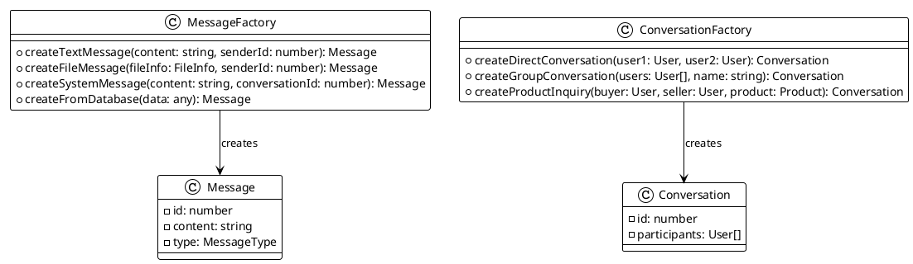
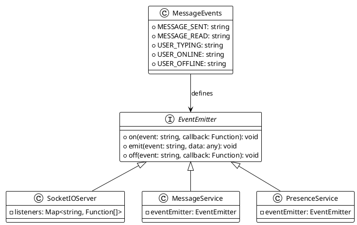
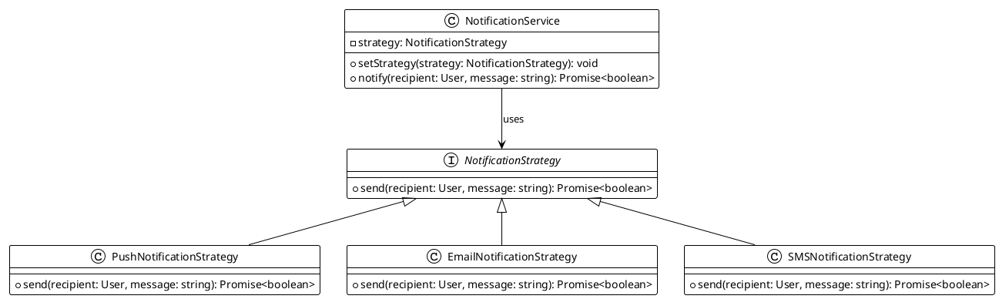

# 🏗️ Diagramme de Classes UML PlantUML - Système de Messagerie
## GabMarketHub - Architecture Orientée Objet

```plantuml
@startuml Messagerie_Classes
!theme plain
skinparam backgroundColor white

package "üîå Socket.IO Core" {
    class SocketIOServer {
        -io: Server
        -authenticatedUsers: Map<string, User>
        -activeRooms: Map<string, Room>
        -messageQueue: Queue
        +initialize(): void
        +authenticate(socket: Socket, token: string): Promise<User>
        +handleConnection(socket: Socket): void
        +handleDisconnection(socket: Socket): void
        +broadcastToRoom(roomId: string, event: string, data: any): void
        +handleError(socket: Socket, error: Error): void
    }

    class Socket {
        -id: string
        -userId: string
        -rooms: Set<string>
        -isAuthenticated: boolean
        -lastActivity: Date
        +join(roomId: string): void
        +leave(roomId: string): void
        +emit(event: string, data: any): void
        +on(event: string, callback: Function): void
        +disconnect(): void
        +updateActivity(): void
    }

    class Room {
        -id: string
        -conversation_id: number
        -participants: Set<string>
        -typingUsers: Set<string>
        -created_at: Date
        +addUser(socketId: string): void
        +removeUser(socketId: string): void
        +broadcastMessage(message: Message, excludeSocketId?: string): void
        +setUserTyping(socketId: string): void
        +setUserStoppedTyping(socketId: string): void
        +getActiveUsers(): string[]
        +isEmpty(): boolean
    }
}

package "üë• Domain Models" {
    class User {
        -id: number
        -nom: string
        -prenom: string
        -email: string
        -role_id: number
        -statut: string
        -isOnline: boolean
        -lastSeen: Date
        -socketId: string
        +getFullName(): string
        +isActive(): boolean
        +getPresenceStatus(): string
        +updateLastSeen(): void
        +setOnlineStatus(status: boolean): void
    }

    class Conversation {
        -id: number
        -participants: User[]
        -product_id: number
        -created_at: Date
        -updated_at: Date
        -last_message_id: number
        -unread_count: Map<number, number>
        +addParticipant(user: User): void
        +removeParticipant(user: User): void
        +isParticipant(userId: number): boolean
        +getRoomId(): string
        +getUnreadCount(userId: number): number
        +updateLastMessage(message: Message): void
        +markAsRead(userId: number): void
    }

    class Message {
        -id: number
        -conversation_id: number
        -sender_id: number
        -content: string
        -type: MessageType
        -created_at: Date
        -read_at: Date
        -file_url: string
        -metadata: JSON
        +isRead(): boolean
        +getFormattedContent(): string
        +getFileInfo(): FileInfo
        +markAsRead(): void
        +getAge(): number
        +serialize(): object
    }

    enum MessageType {
        TEXT
        IMAGE
        FILE
        AUDIO
        LOCATION
        SYSTEM
    }
}

package "üîî Services" {
    class MessageService {
        -db: Database
        -socketServer: SocketIOServer
        -fileUploadService: FileUploadService
        +sendMessage(senderId: number, conversationId: number, content: string, type: MessageType): Promise<Message>
        +getConversationHistory(conversationId: number, page: number, limit: number): Promise<Message[]>
        +searchMessages(conversationId: number, query: string): Promise<Message[]>
        +markMessageAsRead(messageId: number, userId: number): Promise<void>
        +uploadFile(file: File, conversationId: number): Promise<string>
        +deleteMessage(messageId: number, userId: number): Promise<boolean>
    }

    class ConversationService {
        -db: Database
        -socketServer: SocketIOServer
        +createConversation(participants: User[], productId?: number): Promise<Conversation>
        +getConversation(conversationId: number): Promise<Conversation>
        +getUserConversations(userId: number): Promise<Conversation[]>
        +joinConversation(userId: number, conversationId: number): Promise<boolean>
        +leaveConversation(userId: number, conversationId: number): Promise<boolean>
        +getUnreadConversations(userId: number): Promise<Conversation[]>
        +archiveConversation(conversationId: number, userId: number): Promise<boolean>
    }

    class PresenceService {
        -redis: RedisClient
        -socketServer: SocketIOServer
        -userPresence: Map<number, PresenceInfo>
        +setUserOnline(userId: number, socketId: string): Promise<void>
        +setUserOffline(userId: number): Promise<void>
        +getUserPresence(userId: number): Promise<PresenceInfo>
        +getOnlineUsers(): Promise<User[]>
        +broadcastPresenceUpdate(userId: number, status: string): void
        +cleanupOfflineUsers(): Promise<void>
    }

    class NotificationService {
        -pushService: PushNotificationService
        -emailService: EmailService
        -db: Database
        +sendMessageNotification(message: Message, recipients: User[]): Promise<void>
        +sendTypingNotification(conversationId: number, userId: number): void
        +sendPresenceNotification(userId: number, status: PresenceStatus): void
        +scheduleOfflineNotification(message: Message, recipient: User): Promise<void>
        +sendBulkNotifications(notifications: Notification[]): Promise<void>
    }

    class FileUploadService {
        -storage: StorageProvider
        -allowedTypes: string[]
        -maxFileSize: number
        +uploadFile(file: File, conversationId: number, userId: number): Promise<FileInfo>
        +validateFile(file: File): boolean
        +generateThumbnail(file: File): Promise<string>
        +deleteFile(fileUrl: string): Promise<boolean>
        +getFileMetadata(fileUrl: string): Promise<FileInfo>
    }
}

package "🛡️ Utilities" {
    class MessageValidator {
        -maxLength: number
        -forbiddenWords: string[]
        -urlPattern: RegExp
        +validateContent(content: string): ValidationResult
        +sanitizeContent(content: string): string
        +checkSpam(message: Message, userId: number): boolean
        +validateFileUpload(file: File): ValidationResult
    }

    class RateLimiter {
        -limits: Map<number, RateLimit>
        -redis: RedisClient
        +checkLimit(userId: number, action: string): Promise<boolean>
        +incrementCounter(userId: number, action: string): Promise<void>
        +resetLimit(userId: number, action: string): Promise<void>
        +getRemainingLimit(userId: number, action: string): Promise<number>
    }

    class MessageQueue {
        -redis: RedisClient
        -workers: Worker[]
        +addMessage(message: QueuedMessage): Promise<void>
        +processMessages(): Promise<void>
        +retryFailedMessages(): Promise<void>
        +getQueueStats(): QueueStats
    }

    class Analytics {
        -db: Database
        -metricsCollector: MetricsCollector
        +trackMessage(message: Message): void
        +trackUserActivity(userId: number, activity: string): void
        +getConversationStats(conversationId: number): Promise<ConversationStats>
        +getUserEngagementStats(userId: number): Promise<EngagementStats>
        +getSystemMetrics(): Promise<SystemMetrics>
    }
}

package "üìä Data Models" {
    class PresenceInfo {
        -userId: number
        -isOnline: boolean
        -lastSeen: Date
        -socketId: string
        -status: PresenceStatus
        +isRecent(): boolean
        +getDisplayStatus(): string
        +updateActivity(): void
    }

    enum PresenceStatus {
        ONLINE
        AWAY
        BUSY
        OFFLINE
        TYPING
    }

    class FileInfo {
        -originalName: string
        -fileName: string
        -url: string
        -size: number
        -mimeType: string
        -thumbnailUrl: string
        +isImage(): boolean
        +isVideo(): boolean
        +getHumanReadableSize(): string
        +getThumbnail(): string
    }

    class ValidationResult {
        -isValid: boolean
        -errors: string[]
        -warnings: string[]
        +hasErrors(): boolean
        +hasWarnings(): boolean
        +getErrorMessage(): string
    }

    class RateLimit {
        -maxRequests: number
        -windowMs: number
        -currentCount: number
        -resetTime: Date
        +isExceeded(): boolean
        +getRemainingRequests(): number
        +getResetTime(): Date
    }

    class QueuedMessage {
        -id: string
        -type: string
        -payload: any
        -priority: number
        -attempts: number
        -created_at: Date
        -process_after: Date
        +canProcess(): boolean
        +incrementAttempts(): void
        +shouldRetry(): boolean
    }

    class ConversationStats {
        -totalMessages: number
        -averageResponseTime: number
        -participantsCount: number
        -mostActiveUser: User
        -peakActivityTime: Date
        +getResponseTimeFormatted(): string
        +getActivityLevel(): string
    }
}

' Relations principales
SocketIOServer ||--o{ Socket : manages
SocketIOServer ||--o{ Room : contains
Socket }o--|| User : belongs_to
Room ||--o{ Message : broadcasts
Conversation ||--o{ Message : contains
Conversation }o--o{ User : participants
User ||--o{ Message : sends
Room }o--|| Conversation : represents

' Relations services
MessageService --> Message : creates
MessageService --> ConversationService : uses
ConversationService --> Conversation : manages
PresenceService --> PresenceInfo : manages
PresenceService --> User : tracks
NotificationService --> Message : notifies_about
FileUploadService --> FileInfo : creates

' Relations utilitaires
MessageValidator --> ValidationResult : returns
RateLimiter --> RateLimit : manages
MessageQueue --> QueuedMessage : processes
Analytics --> ConversationStats : generates

' Relations inter-services
MessageService --> MessageValidator : validates_with
MessageService --> RateLimiter : checks_with
MessageService --> NotificationService : notifies_with
MessageService --> FileUploadService : uploads_with
SocketIOServer --> PresenceService : updates_presence
SocketIOServer --> MessageQueue : queues_messages
SocketIOServer --> Analytics : tracks_metrics

@enduml
```

## üîß **Patrons de Conception - PlantUML**

### üè≠ **Factory Pattern**

```plantuml
@startuml Factory_Pattern
!theme plain

class MessageFactory {
    +createTextMessage(content: string, senderId: number): Message
    +createFileMessage(fileInfo: FileInfo, senderId: number): Message
    +createSystemMessage(content: string, conversationId: number): Message
    +createFromDatabase(data: any): Message
}

class ConversationFactory {
    +createDirectConversation(user1: User, user2: User): Conversation
    +createGroupConversation(users: User[], name: string): Conversation
    +createProductInquiry(buyer: User, seller: User, product: Product): Conversation
}

class Message {
    -id: number
    -content: string
    -type: MessageType
}

class Conversation {
    -id: number
    -participants: User[]
}

MessageFactory --> Message : creates
ConversationFactory --> Conversation : creates

@enduml
```

### üé≠ **Observer Pattern**

```plantuml
@startuml Observer_Pattern
!theme plain

interface EventEmitter {
    +on(event: string, callback: Function): void
    +emit(event: string, data: any): void
    +off(event: string, callback: Function): void
}

class MessageEvents {
    +MESSAGE_SENT: string
    +MESSAGE_READ: string
    +USER_TYPING: string
    +USER_ONLINE: string
    +USER_OFFLINE: string
}

class SocketIOServer {
    -listeners: Map<string, Function[]>
}

class MessageService {
    -eventEmitter: EventEmitter
}

class PresenceService {
    -eventEmitter: EventEmitter
}

EventEmitter <|-- SocketIOServer
EventEmitter <|-- MessageService
EventEmitter <|-- PresenceService
MessageEvents --> EventEmitter : defines

@enduml
```

### üîå **Strategy Pattern**

```plantuml  
@startuml Strategy_Pattern
!theme plain

interface NotificationStrategy {
    +send(recipient: User, message: string): Promise<boolean>
}

class PushNotificationStrategy {
    +send(recipient: User, message: string): Promise<boolean>
}

class EmailNotificationStrategy {
    +send(recipient: User, message: string): Promise<boolean>
}

class SMSNotificationStrategy {
    +send(recipient: User, message: string): Promise<boolean>
}

class NotificationService {
    -strategy: NotificationStrategy
    +setStrategy(strategy: NotificationStrategy): void
    +notify(recipient: User, message: string): Promise<boolean>
}

NotificationStrategy <|-- PushNotificationStrategy
NotificationStrategy <|-- EmailNotificationStrategy
NotificationStrategy <|-- SMSNotificationStrategy
NotificationService --> NotificationStrategy : uses

@enduml
```

---

*Diagramme généré pour GabMarketHub - Système de Messagerie Temps Réel*
*Version PlantUML compatible - Novembre 2025*