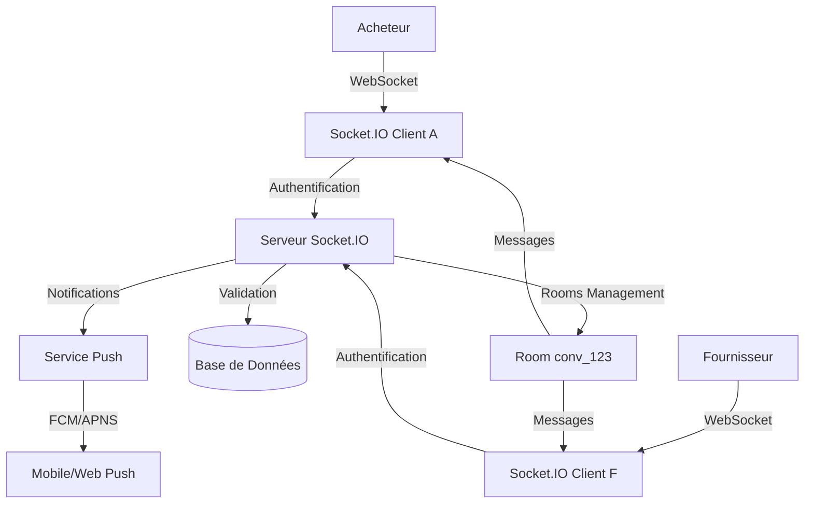
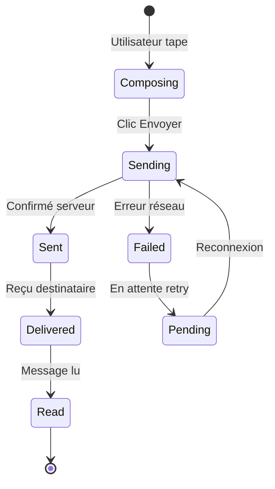

# 📱 Diagramme de Séquence UML - Système de Messagerie Temps Réel
## GabMarketHub - Socket.IO Communication

```mermaid
sequenceDiagram
    participant A as Acheteur (Client)
    participant SA as Socket.IO Client A
    participant S as Serveur Socket.IO
    participant DB as Base de Données MySQL
    participant SF as Socket.IO Client F
    participant F as Fournisseur (Client)

    Note over A,F: 🔗 Établissement de la connexion WebSocket

    A->>SA: Se connecter à la plateforme
    SA->>S: socket.connect() avec auth token
    S->>DB: Vérifier authentification utilisateur
    DB-->>S: Données utilisateur validées
    S->>SA: Connexion établie + user_id
    SA-->>A: État: Connecté

    F->>SF: Se connecter à la plateforme  
    SF->>S: socket.connect() avec auth token
    S->>DB: Vérifier authentification utilisateur
    DB-->>S: Données utilisateur validées
    S->>SF: Connexion établie + user_id
    SF-->>F: État: Connecté

    Note over A,F: 👥 Gestion des présences et rooms

    S->>S: Ajouter utilisateurs aux rooms actives
    S->>SA: emit('user_online', {user_id, status: 'online'})
    S->>SF: emit('user_online', {user_id, status: 'online'})

    Note over A,F: 💬 Initiation d'une conversation

    A->>SA: Démarrer conversation avec fournisseur
    SA->>S: emit('join_conversation', {receiver_id: F.id, product_id?})
    
    S->>DB: Créer/Récupérer conversation
    Note over DB: INSERT/SELECT conversations
    DB-->>S: conversation_id, participants
    
    S->>S: Créer room "conv_123"
    S->>SA: socket.join("conv_123")
    S->>SF: socket.join("conv_123") 
    
    S->>SA: emit('conversation_joined', {conversation_id, participants})
    S->>SF: emit('conversation_joined', {conversation_id, participants})
    
    SA-->>A: Interface conversation ouverte
    SF-->>F: Notification nouvelle conversation

    Note over A,F: ✍️ Indicateur "en train d'écrire"

    A->>SA: L'utilisateur commence à taper
    SA->>S: emit('typing_start', {conversation_id})
    S->>SF: emit('user_typing', {user_id: A.id, conversation_id})
    SF-->>F: Afficher "Acheteur est en train d'écrire..."

    A->>SA: L'utilisateur arrête de taper (timeout 3s)
    SA->>S: emit('typing_stop', {conversation_id})
    S->>SF: emit('user_stop_typing', {user_id: A.id, conversation_id})
    SF-->>F: Masquer indicateur

    Note over A,F: 📨 Envoi et réception de messages

    A->>SA: Envoyer message "Bonjour, je suis intéressé"
    SA->>S: emit('send_message', {conversation_id, content, type: 'text'})
    
    S->>DB: Sauvegarder message
    Note over DB: INSERT INTO messages (conversation_id, sender_id, content, type, created_at)
    DB-->>S: message_id, timestamp
    
    S->>S: to("conv_123").emit('new_message', message_data)
    S->>SA: emit('message_sent', {message_id, status: 'delivered'})
    S->>SF: emit('new_message', {message_id, sender_id, content, timestamp})
    
    SA-->>A: Message affiché avec statut "envoyé"
    SF-->>F: Nouveau message affiché + son notification

    Note over A,F: 📎 Envoi de fichier/image

    F->>SF: Joindre image produit
    SF->>S: emit('send_file', {conversation_id, file_data, type: 'image'})
    
    S->>S: Traiter upload fichier
    S->>DB: Sauvegarder métadonnées fichier
    DB-->>S: file_url, message_id
    
    S->>S: to("conv_123").emit('new_message', {type: 'file', file_url, filename})
    S->>SA: emit('new_message', {message_id, type: 'file', file_url})
    S->>SF: emit('message_sent', {message_id, status: 'delivered'})
    
    SA-->>A: Image/fichier affiché
    SF-->>F: Confirmation envoi

    Note over A,F: 👁️ Accusés de réception et lecture

    A->>SA: Message visible à l'écran
    SA->>S: emit('message_read', {message_id, conversation_id})
    
    S->>DB: Mettre à jour statut message
    Note over DB: UPDATE messages SET read_at = NOW() WHERE id = message_id
    DB-->>S: Confirmation mise à jour
    
    S->>SF: emit('message_read_receipt', {message_id, reader_id: A.id})
    SF-->>F: Afficher "Lu" sous le message

    Note over A,F: 🔍 Recherche dans l'historique

    A->>SA: Rechercher "prix" dans la conversation
    SA->>S: emit('search_messages', {conversation_id, query: "prix", page: 1})
    
    S->>DB: Recherche full-text dans messages
    Note over DB: SELECT * FROM messages WHERE conversation_id = ? AND content LIKE '%prix%'
    DB-->>S: Résultats de recherche
    
    S->>SA: emit('search_results', {results, total_count, page})
    SA-->>A: Afficher résultats surlignés

    Note over A,F: 🔔 Notifications push

    F->>SF: Se déconnecter (ferme navigateur)
    SF->>S: socket.disconnect()
    S->>S: Marquer utilisateur hors ligne
    S->>SA: emit('user_offline', {user_id: F.id})

    A->>SA: Envoyer message à F (hors ligne)
    SA->>S: emit('send_message', {conversation_id, content})
    
    S->>DB: Sauvegarder message
    DB-->>S: message_id
    
    S->>S: Destinataire hors ligne - déclencher notification push
    S->>S: Service de notifications externes (FCM/APNS)
    
    Note over S: Push notification: "Nouveau message de [Acheteur]"
    
    S->>SA: emit('message_sent', {status: 'delivered_offline'})
    SA-->>A: Message marqué "envoyé" avec indicateur hors ligne

    Note over A,F: 🔄 Reconnexion et synchronisation

    F->>SF: Se reconnecte plus tard
    SF->>S: socket.connect() avec auth token
    S->>DB: Récupérer messages non lus
    
    Note over DB: SELECT * FROM messages WHERE conversation_id IN (...) AND read_at IS NULL AND receiver_id = F.id
    DB-->>S: Liste messages non lus
    
    S->>SF: emit('unread_messages', {messages, conversations})
    S->>SF: emit('user_online', {user_id: F.id, status: 'online'})
    S->>SA: emit('user_online', {user_id: F.id, status: 'online'})
    
    SF-->>F: Badge notifications + messages non lus
    SA-->>A: Indicateur "F en ligne"

    Note over A,F: ⚡ Gestion des erreurs et reconnexion

    SA->>S: emit('send_message') - Connexion perdue
    S-->>SA: Timeout / Erreur réseau
    
    SA->>SA: Tentative de reconnexion automatique
    SA->>S: socket.connect() - Retry
    S-->>SA: Connexion rétablie
    
    SA->>S: emit('sync_pending_messages') - Resynchroniser
    S->>DB: Vérifier messages en attente
    DB-->>S: État des messages
    S->>SA: emit('sync_complete', {pending_messages})
    
    SA-->>A: Messages synchronisés + indicateurs de statut mis à jour

    Note over A,F: 📊 Métriques et analytics temps réel

    S->>DB: Logger événements messagerie
    Note over DB: INSERT INTO message_analytics (event_type, user_id, conversation_id, timestamp)
    
    S->>S: Calculer métriques temps réel
    Note over S: - Messages/minute<br/>- Utilisateurs actifs<br/>- Temps de réponse moyen<br/>- Taux de conversion conversations
```

## 🏗️ Architecture Détaillée

### 📡 **Connexions et Rooms**

### 🔄 **États des Messages**

## 📋 **Événements Socket.IO**

### 🔗 **Connexion & Authentification**
| Événement | Direction | Données | Description |
|-----------|-----------|---------|-------------|
| `connect` | Client→Serveur | `{auth_token}` | Connexion initiale |
| `authenticated` | Serveur→Client | `{user_id, status}` | Authentification réussie |
| `join_conversation` | Client→Serveur | `{receiver_id, product_id?}` | Rejoindre/créer conversation |
| `conversation_joined` | Serveur→Client | `{conversation_id, participants}` | Confirmation room |

### 💬 **Messages**
| Événement | Direction | Données | Description |
|-----------|-----------|---------|-------------|
| `send_message` | Client→Serveur | `{conversation_id, content, type}` | Envoyer message |
| `new_message` | Serveur→Client | `{message_id, sender_id, content, timestamp}` | Nouveau message |
| `message_sent` | Serveur→Client | `{message_id, status}` | Confirmation envoi |
| `message_read` | Client→Serveur | `{message_id}` | Marquer comme lu |

### 👁️ **Présence & Activité**
| Événement | Direction | Données | Description |
|-----------|-----------|---------|-------------|
| `user_online` | Serveur→Client | `{user_id, status}` | Utilisateur en ligne |
| `user_offline` | Serveur→Client | `{user_id}` | Utilisateur hors ligne |
| `typing_start` | Client→Serveur | `{conversation_id}` | Commence à taper |
| `user_typing` | Serveur→Client | `{user_id, conversation_id}` | Indicateur frappe |

### 🔍 **Recherche & Historique**
| Événement | Direction | Données | Description |
|-----------|-----------|---------|-------------|
| `search_messages` | Client→Serveur | `{conversation_id, query, page}` | Rechercher messages |
| `search_results` | Serveur→Client | `{results, total, page}` | Résultats recherche |
| `load_history` | Client→Serveur | `{conversation_id, before_id, limit}` | Charger historique |
| `history_loaded` | Serveur→Client | `{messages, has_more}` | Messages historiques |

## 🛡️ **Sécurité & Performance**

### 🔐 **Authentification**
- ✅ JWT token validation sur chaque connexion
- ✅ Rate limiting par utilisateur (100 messages/minute)
- ✅ Validation des permissions conversation
- ✅ Sanitisation du contenu des messages

### ⚡ **Optimisations**
- ✅ Rooms isolées par conversation
- ✅ Compression des messages WebSocket
- ✅ Reconnexion automatique avec backoff
- ✅ Cache Redis pour sessions actives
- ✅ Pagination de l'historique

### 📊 **Monitoring**
- ✅ Métriques temps réel (connexions actives)
- ✅ Logs d'audit des conversations
- ✅ Alertes sur pics de trafic
- ✅ Analytics des temps de réponse

---

*Diagramme généré pour GabMarketHub - Système de Messagerie Temps Réel*
*Dernière mise à jour: Novembre 2025*