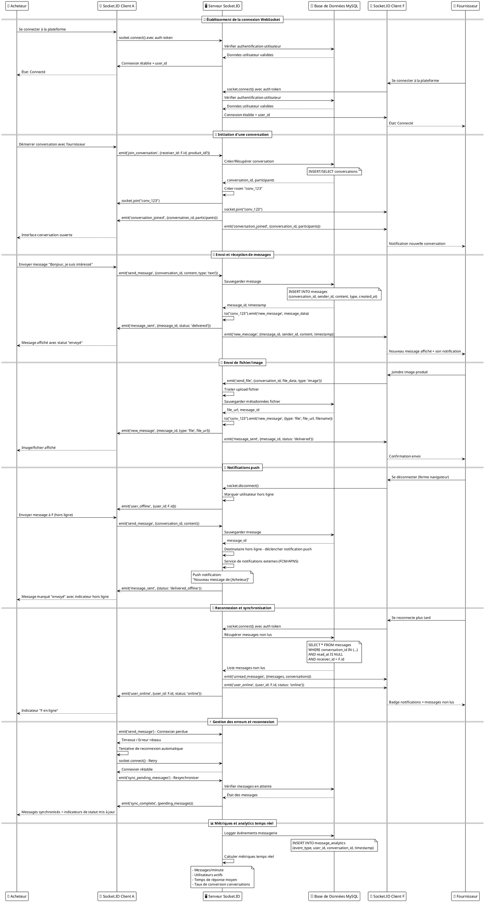
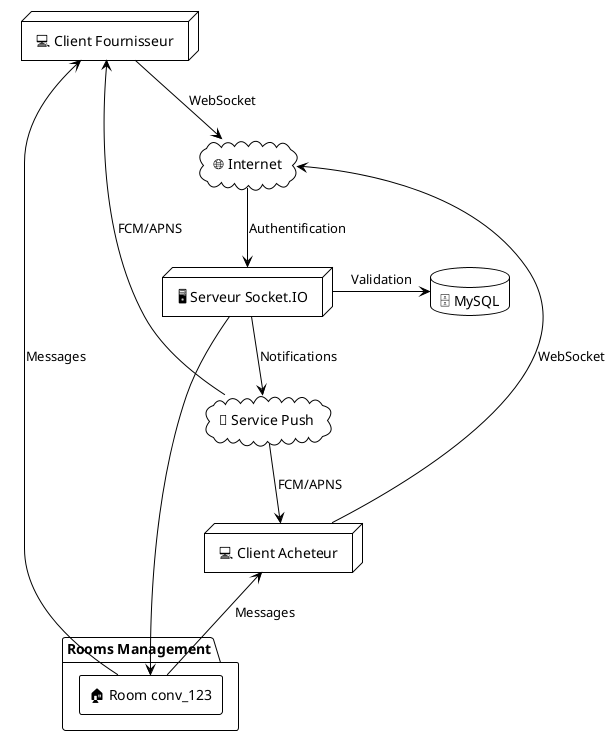
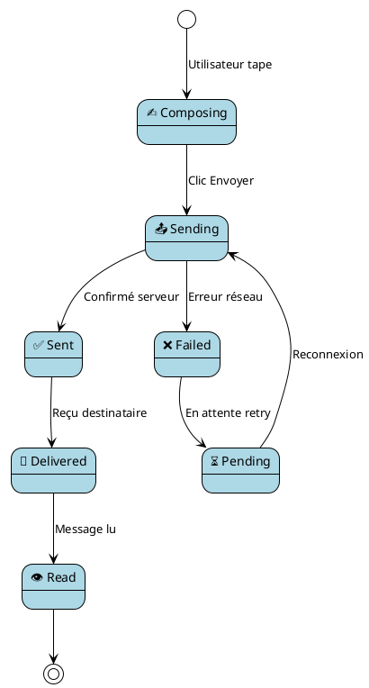

# 📱 Diagramme de Séquence UML PlantUML - Système de Messagerie Temps Réel
## GabMarketHub - Socket.IO Communication

## 🏗️ Architecture Détaillée PlantUML

### 📡 **Connexions et Rooms**

### 🔄 **États des Messages**

---

*Diagramme généré pour GabMarketHub - Système de Messagerie Temps Réel*
*Version PlantUML compatible - Novembre 2025*